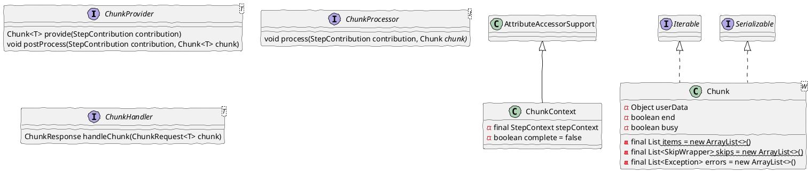
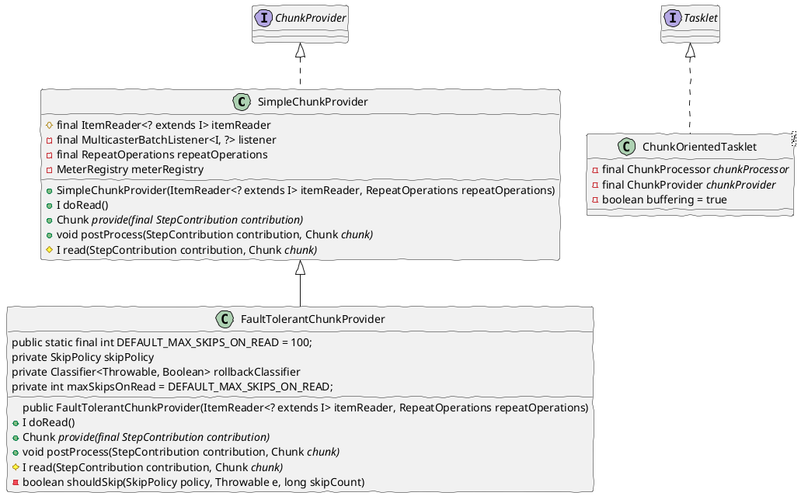

# spring-batch-chunk   


::top-left::
**ChunkOrientedTasklet**

```java
class ChunkOrientedTasklet<I> implements Tasklet {
	private final ChunkProcessor<I> chunkProcessor
	private final ChunkProvider<I> chunkProvider
	public ChunkOrientedTasklet(ChunkProvider<I> chunkProvider,ChunkProcessor<I> chunkProcessor){
		this.chunkProvider = chunkProvider
		this.chunkProcessor = chunkProcessor
	}
	public RepeatStatus execute(StepContribution contribution, ChunkContext chunkContext){
		Chunk<I> inputs = (Chunk<I>) chunkContext.getAttribute(INPUTS_KEY);
		chunkProcessor.process(contribution, inputs);
		chunkProvider.postProcess(contribution, inputs);
		chunkContext.removeAttribute(INPUTS_KEY);
		chunkContext.setComplete();
		return RepeatStatus.continueIf(!inputs.isEnd());
	}
}
```
::top-right::
**ChunkProvider**
- SimpleChunkProvider    
- FaultTolerantChunkProvider    
```java
public class FaultTolerantChunkProvider<I> extends SimpleChunkProvider<I> {
	public static final int DEFAULT_MAX_SKIPS_ON_READ = 100;
	private SkipPolicy skipPolicy = new LimitCheckingItemSkipPolicy();
	private Classifier<Throwable, Boolean> rollbackClassifier = new BinaryExceptionClassifier(true);
	private int maxSkipsOnRead = DEFAULT_MAX_SKIPS_ON_READ;
	public FaultTolerantChunkProvider(ItemReader<? extends I> itemReader, RepeatOperations repeatOperations) {
		super(itemReader, repeatOperations);
	}
}
```
::bottom-left::
**Chunk, ChunkProvider, ChunkProcessor**    
<Transform :scale="1.0">


</Transform>

::bottom-right::

**ChunkProvider - SimpleChunkProvider, FaultTolerantChunkProvider**

<Transform :scale="1.0">


</Transform>
