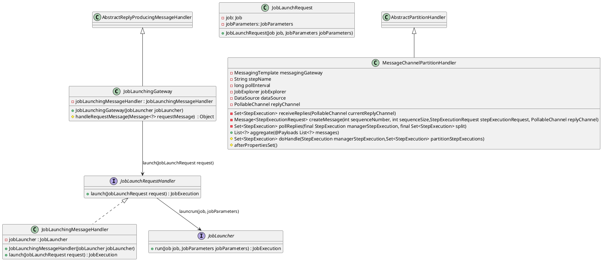

# spring-batch-launch   

::top-left::
**JobLauncher** 

```java
public interface JobLauncher {
    JobExecution run(Job job, JobParameters jobParameters)
}
```

::top-right::
**TaskExecutorJobLauncher**
```java
public class TaskExecutorJobLauncher implements JobLauncher, InitializingBean {
	private JobRepository jobRepository;
	private TaskExecutor taskExecutor;
	private MeterRegistry meterRegistry = Metrics.globalRegistry;
    public JobExecution run(final Job job, final JobParameters jobParameters) throws JobExecutionAlreadyRunningException, JobRestartException, JobInstanceAlreadyCompleteException, JobParametersInvalidException {
        taskExecutor.execute(new Runnable() {
			    public void run() {
                job.execute(jobExecution);
            }
        }
    }
}
```


::bottom-left::
**CommandLineJobRunner**    

```java
public class CommandLineJobRunner {
	private ExitCodeMapper exitCodeMapper = new SimpleJvmExitCodeMapper();
	private JobLauncher launcher;
	private JobLocator jobLocator;
	private static SystemExiter systemExiter = new JvmSystemExiter();
	private JobParametersConverter jobParametersConverter = new DefaultJobParametersConverter();
	private JobExplorer jobExplorer;
	private JobRepository jobRepository;
    public static void main(String[] args) throws Exception {
        CommandLineJobRunner command = new CommandLineJobRunner();
		    int result = command.start(jobPath, jobIdentifier, parameters, opts);
		    command.exit(result);
    }
    int start(String jobPath, String jobIdentifier, String[] parameters, Set<String> opts) {
        job = jobLocator.getJob(jobName);
        job = (Job) context.getBean(jobName);
		JobExecution jobExecution = launcher.run(job, jobParameters);
		return exitCodeMapper.intValue(jobExecution.getExitStatus().getExitCode());
    }
}
```
::bottom-right::

**spring-integration - JobLaunchingGateway**



