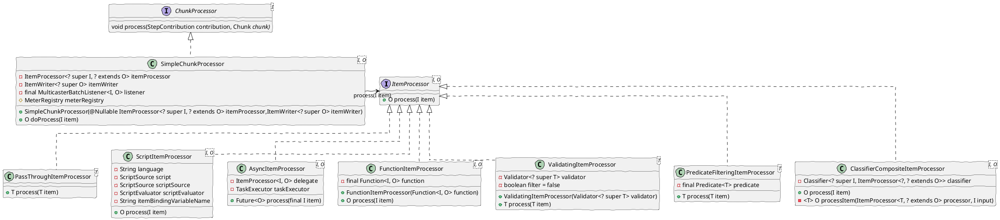

# spring-batch-processor   


```java

public class SimpleChunkProcessor<I, O> implements ChunkProcessor<I>, InitializingBean {
	private ItemProcessor<? super I, ? extends O> itemProcessor;
	private ItemWriter<? super O> itemWriter;
	private final MulticasterBatchListener<I, O> listener = new MulticasterBatchListener<>();
	protected MeterRegistry meterRegistry = Metrics.globalRegistry;

	protected final O doProcess(I item) throws Exception {
		if (itemProcessor == null) {
			@SuppressWarnings("unchecked")
			O result = (O) item;
			return result;
		}
		try {
			listener.beforeProcess(item);
			O result = itemProcessor.process(item);
			listener.afterProcess(item, result);
			return result;
		}
		catch (Exception e) {
			listener.onProcessError(item, e);
			throw e;
		}
	}
}

```


<Transform :scale="1.0">

</Transform>
