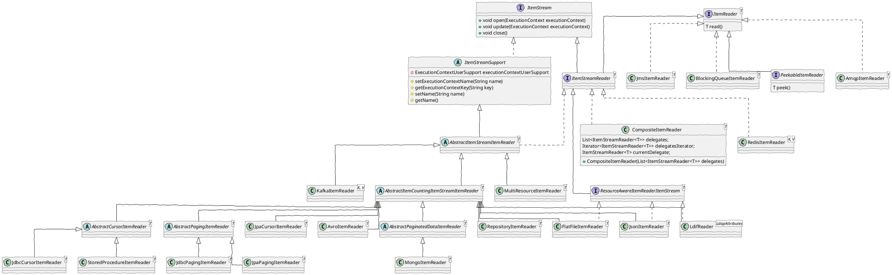

# spring-batch-reader   

- SQL (jpa,jdbc,stored procedure), mq, amap, nosql
- File - json, csv, fixlength, xml
- Messaging - Kafka, Jms, Ldif, BlockingQueue

<Transform :scale="1.0">

</Transform>
