```plantuml
@startuml
skinparam handwritten true
skinparam linetype polyline
skinparam linetype ortho

interface ItemWriter<T> {
	void write(Chunk<? extends T> chunk)
}
interface ItemStream {
	+ void open(ExecutionContext executionContext)
	+ void update(ExecutionContext executionContext)
	+ void close() 
}
interface ItemStreamWriter<T> extends ItemStream, ItemWriter<T> {
}
abstract class KeyValueItemWriter<K, V> implements ItemWriter<V> {
	# Converter<V, K> itemKeyMapper
	# boolean delete
}
class AmqpItemWriter<T> implements ItemWriter<T> {
	- final AmqpTemplate amqpTemplate
}
class MongoItemWriter<T> implements ItemWriter<T> {
    - MongoOperations template
}
class JsonFileItemWriter<T> extends AbstractFileItemWriter<T> {
    - JsonObjectMarshaller<T> jsonObjectMarshaller
}
class RepositoryItemWriter<T> implements ItemWriter<T> {
	- CrudRepository<T, ?> repository
}
class AsyncItemWriter<T> implements ItemStreamWriter<Future<T>> {
	- ItemWriter<T> delegate
}
class ConsumerItemWriter<T> implements ItemWriter<T> {
	- final Consumer<T> consumer
}
class CompositeItemWriter<T> implements ItemStreamWriter<T> {
	- List<ItemWriter<? super T>> delegates
	- boolean ignoreItemStream = false
}
class JdbcBatchItemWriter<T> implements ItemWriter<T> {
	# NamedParameterJdbcOperations namedParameterJdbcTemplate
	# ItemPreparedStatementSetter<T> itemPreparedStatementSetter
	# ItemSqlParameterSourceProvider<T> itemSqlParameterSourceProvider
	# String sql
	# boolean assertUpdates = true
	# int parameterCount
	# boolean usingNamedParameters
}
class MultiResourceItemWriter<T> extends AbstractItemStreamItemWriter<T> {
	- Resource resource
	- ResourceAwareItemWriterItemStream<? super T> delegate
	- int itemCountLimitPerResource
	- int currentResourceItemCount
	- int resourceIndex
	- ResourceSuffixCreator suffixCreator
	- boolean saveState = true
	- boolean opened = false
}
class BlockingQueueItemWriter<T> implements ItemWriter<T> {
	- final BlockingQueue<T> queue
}
class SynchronizedItemWriter<T> implements ItemWriter<T> {
	- final ItemWriter<T> delegate
	- final Lock lock = new ReentrantLock()
}
class SimpleMailMessageItemWriter implements ItemWriter<SimpleMailMessage> {
	- MailSender mailSender
	- MailErrorHandler mailErrorHandler
}
class ClassifierCompositeItemWriter<T> implements ItemWriter<T> {
	- Classifier<T, ItemWriter<? super T>> classifier
}
class FlatFileItemWriter<T> extends AbstractFileItemWriter<T> {
	# LineAggregator<T> lineAggregator;
}
@enduml
```  

# spring-batch-writer   


- SQL (jpa,jdbc,stored procedure), mq, amap, nosql
- File - json, csv, fixlength, xml
- Messaging - Kafka, Jms, Ldif, BlockingQueue


```java
interface ItemWriter<T> {
	void write(Chunk<? extends T> chunk)
}
```

```java
public interface ItemStream {
	default void open(ExecutionContext executionContext) throws ItemStreamException {}
	default void update(ExecutionContext executionContext) throws ItemStreamException {}
	default void close() throws ItemStreamException {}
}
```


<Transform :scale="1.0">


</Transform>
