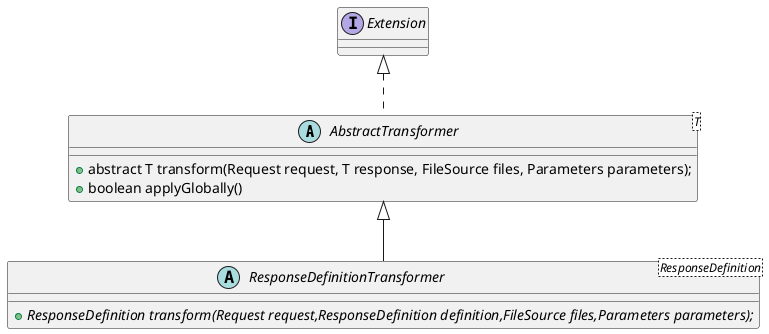

# wiremock-response-templating   


```java
WireMockServer wm = new WireMockServer(options().globalTemplating(true));
```




> The request    

`request.pathSegments.[<n>]` - URL path segment (zero indexed)     
`request.query.<key>` - First value of a query parameter     
`request.headers.[<key>]` - Header with awkward characters        
`request.cookies.<key>` - First value of a request cookie    
`request.body` - Request body text    


> [Handlebars helpers](https://wiremock.org/docs/response-templating/#handlebars-helpers)    

> Date and time helpers     

> Random value helper    

> Formatting numbers    

> XPath helpers     
